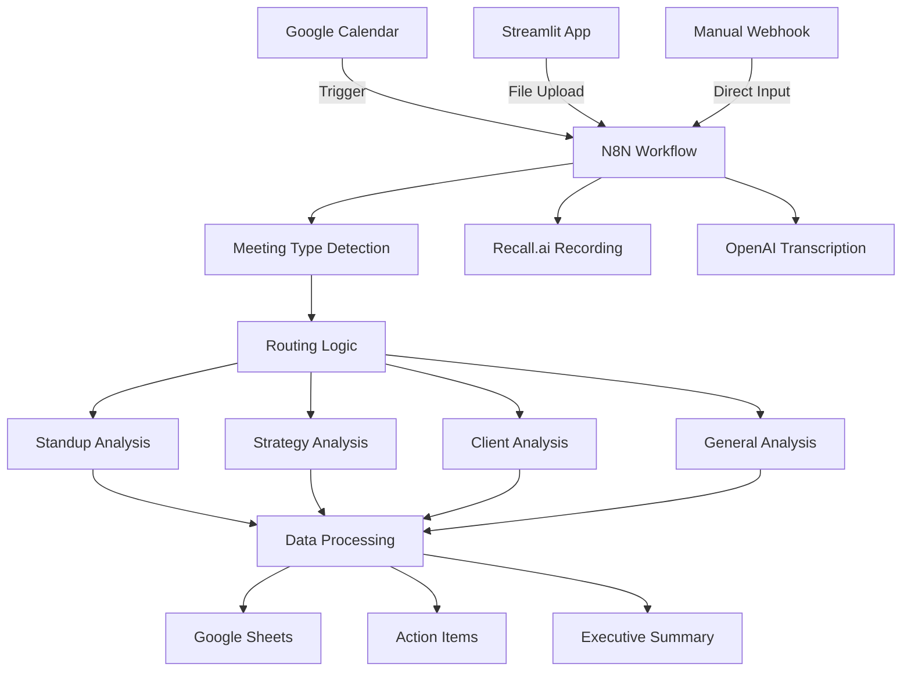

# Module 2: Meeting Workflow Automation System

## Table of Contents
1. [System Overview](#system-overview)
2. [Architecture](#architecture)
3. [Prerequisites](#prerequisites)
4. [Installation Guide](#installation-guide)
5. [Component Details](#component-details)
6. [N8N Workflow Technical Reference](#n8n-workflow-technical-reference)
7. [Configuration Guide](#configuration-guide)
8. [Usage Examples](#usage-examples)
9. [Troubleshooting Guide](#troubleshooting-guide)
10. [Security Considerations](#security-considerations)
11. [API Reference](#api-reference)
12. [Extension Guide](#extension-guide)

---

## System Overview

This comprehensive meeting workflow automation system combines a Streamlit web interface with a sophisticated N8N workflow to provide intelligent meeting analysis, transcription, and data management. The system automatically processes meetings from multiple sources, extracts actionable insights using AI, and stores structured data in Google Sheets for business intelligence.

### Core Components
- **Streamlit File Uploader** (`streamlit_n8n_uploader.py`): Web interface for manual file uploads
- **N8N Meeting Workflow** (`meeting_workflow.json`): Automated pipeline with 24+ nodes for complete meeting processing
- **External Integrations**: OpenAI, Google Sheets, Google Calendar, Recall.ai

### Key Capabilities
- **Multi-input Processing**: Text files, audio files, Google Calendar integration
- **AI-Powered Analysis**: Meeting-type-specific analysis using GPT-4 models
- **Structured Data Output**: Automated extraction of action items, decisions, and summaries
- **Business Intelligence**: Organized data storage for reporting and analytics

---

## Architecture



### Data Flow
1. **Input Sources**: Calendar events, uploaded files, or direct webhook calls
2. **Processing Pipeline**: Validation → Type detection → AI analysis → Data structuring
3. **Output Storage**: Google Sheets with organized tabs for different data types
4. **Response**: Structured JSON with processing results and status

---

## Prerequisites

### System Requirements
- **Python**: 3.7 or higher
- **Memory**: Minimum 2GB RAM (4GB recommended)
- **Storage**: 1GB free space for dependencies and temporary files
- **Network**: Stable internet connection for API calls

### Required Accounts and Services
1. **N8N Instance** (Self-hosted or Cloud)
2. **OpenAI API Account** with GPT-4 access
3. **Google Cloud Project** with enabled APIs
4. **Recall.ai Account** for meeting recording
5. **Google Workspace** for Sheets and Calendar access

### Technical Skills Required
- Basic command line usage
- Understanding of API keys and authentication
- JSON configuration editing
- Google Cloud Console navigation

---

## Installation Guide

### Phase 1: Environment Setup

#### 1.1 Python Environment
```bash
# Create project directory
mkdir meeting-automation && cd meeting-automation

# Create virtual environment
python -m venv venv

# Activate virtual environment
# On Linux/Mac:
source venv/bin/activate
# On Windows:
venv\Scripts\activate

# Install dependencies
pip install -r requirements.txt
```

#### 1.2 Verify Installation
```bash
# Test Streamlit installation
streamlit hello

# Test requests library
python -c "import requests; print('Requests version:', requests.__version__)"
```

### Phase 2: N8N Setup

#### 2.1 N8N Installation (Docker Method)
```bash
# Create N8N directory
mkdir n8n-data && cd n8n-data

# Create docker-compose.yml
cat > docker-compose.yml << 'EOF'
services:
  n8n:
    image: n8nio/n8n
    restart: always
    ports:
      - '5678:5678'
    environment:
      - N8N_HOST=localhost
      - N8N_PORT=5678
      - N8N_PROTOCOL=http
      - NODE_ENV=production
      - WEBHOOK_URL=http://localhost:5678/
    volumes:
      - './n8n_data:/home/node/.n8n'
volumes:
  n8n_data:
EOF

# Start N8N
docker-compose up -d

# Check status
docker-compose ps
```

#### 2.2 N8N Initial Configuration
1. Access N8N at `http://localhost:5678`
2. Create admin account
3. Accept community license
4. Note webhook base URL for later configuration

### Phase 3: External Service Configuration

#### 3.1 Google Cloud Project Setup
```bash
# Using gcloud CLI (optional)
gcloud projects create meeting-automation-[RANDOM]
gcloud config set project meeting-automation-[RANDOM]

# Enable required APIs
gcloud services enable sheets.googleapis.com
gcloud services enable calendar.googleapis.com
gcloud services enable drive.googleapis.com
```

**Manual Setup via Console:**
1. Visit [Google Cloud Console](https://console.cloud.google.com)
2. Create new project: "Meeting Automation"
3. Enable APIs:
   - Google Sheets API
   - Google Calendar API  
   - Google Drive API

#### 3.2 Service Account Creation
```bash
# Create service account
gcloud iam service-accounts create meeting-automation \
    --description="Service account for meeting automation" \
    --display-name="Meeting Automation"

# Create and download key
gcloud iam service-accounts keys create credentials.json \
    --iam-account=meeting-automation@[PROJECT-ID].iam.gserviceaccount.com
```

**Manual Method:**
1. Go to IAM & Admin > Service Accounts
2. Click "Create Service Account"
3. Name: `meeting-automation`
4. Create and download JSON key file
5. Save as `credentials.json`

#### 3.3 Google Sheets Preparation
1. Create new Google Sheet: "Meeting Analysis Results"
2. Create three tabs with exact names:
   - `Meeting Input Log`
   - `Action Items`
   - `Executive Summary`

3. Share sheet with service account email (from credentials.json)
4. Note the Google Sheet ID from URL

**Sheet Structure:**

*Meeting Input Log columns:*
```
timestamp | meetingType | meetingNotes | attendees | processingStatus | meetingId | fullTranscript | classificationConfidence | classificationReasoning
```

*Action Items columns:*
```
Meeting Date | Meeting Type | Action Item | Owner | Due Date | Priority | Status | Follow-up Required | Meeting ID
```

*Executive Summary columns:*
```
Meeting Date | Meeting Type | Key Decisions | Executive Summary | Next Steps | Attendees | Follow-up Meetings | Risks Identified | Commitments Count | Meeting ID
```

#### 3.4 OpenAI API Setup
1. Visit [OpenAI Platform](https://platform.openai.com)
2. Create account or sign in
3. Go to API section
4. Generate new API key
5. Set up billing and usage limits
6. Test API access:

```bash
# Test API key
curl https://api.openai.com/v1/models \
  -H "Authorization: Bearer $OPENAI_API_KEY"
```

#### 3.5 Recall.ai Setup
1. Visit [Recall.ai](https://recall.ai)
2. Create account and get API key
3. Test API connection:

```bash
curl -X GET https://us-west-2.recall.ai/api/v1/bot \
  -H "Authorization: YOUR_RECALL_API_KEY"
```

### Phase 4: N8N Workflow Configuration

#### 4.1 Import Workflow
1. Open N8N interface (`http://localhost:5678`)
2. Click "Import from file" 
3. Upload `meeting_workflow.json`
4. Workflow will be imported with placeholder configurations

#### 4.2 Configure Credentials in N8N

**Google Sheets Credential:**
1. Go to Settings > Credentials
2. Add "Google Service Account" credential
3. Upload the `credentials.json` file
4. Name: "Google Sheets account"

**OpenAI Credential:**
1. Add "OpenAI API" credential
2. Enter your OpenAI API key
3. Name: "OpenAI API account"

**Google Calendar Credential:**
1. Add "Google Calendar OAuth2 API" credential
2. Follow OAuth2 setup process
3. Authorize calendar access

#### 4.3 Update Workflow Configuration

**Critical Updates Required:**
1. Replace all instances of `REPLACE_WITH_YOUR_GOOGLE_SHEETS_ID` with your actual sheet ID
2. Update Recall.ai API key (currently hardcoded - security issue)
3. Update Google Calendar ID if different from default
4. Configure webhook URLs

**Find and Replace Operations:**
```bash
# In the workflow JSON, find these values and update:
# 1. Google Sheets ID (3 locations)
"documentId": "YOUR_ACTUAL_GOOGLE_SHEETS_ID"

# 2. Recall.ai API key (security issue - should be moved to credentials)
"Authorization": "YOUR_RECALL_API_KEY"

# 3. Calendar ID 
"calendarId": "YOUR_CALENDAR_ID"
```

---

## Component Details

### Streamlit File Uploader

**File Location**: `streamlit_n8n_uploader.py` (131 lines)

#### Core Functionality
- **File Upload Interface**: Web-based drag-and-drop or browse upload
- **File Type Support**: `.txt` (text) and `.mp3` (audio) files only
- **Size Validation**: 25MB maximum file size limit
- **Real-time Preview**: Text files < 1MB show content preview
- **N8N Integration**: Direct POST to webhook endpoints

#### Key Functions

```python
def validate_file_size(file) -> bool:
    """Validate that file size is less than 25MB"""
    return file.size / (1024 * 1024) < 25 if file else False

def send_to_n8n(file, n8n_url: str, file_type: str) -> dict:
    """Send file to N8N webhook URL with comprehensive error handling"""
    # Handles: Timeout, ConnectionError, HTTPError, General exceptions
    # Returns: Success/failure status with detailed error messages
```

#### Configuration Parameters
- **N8N Webhook URL**: User-configurable via web interface
- **Timeout Settings**: 60-second request timeout
- **File Type Restrictions**: Enforced via Streamlit file_uploader
- **Preview Limits**: 1000 characters for text file preview

#### Error Handling Patterns
```python
# Specific exception handling implemented:
requests.exceptions.Timeout          # "Request timed out"
requests.exceptions.ConnectionError  # "Connection error - check N8N URL" 
requests.exceptions.HTTPError        # "HTTP error: {status_code}"
Exception                           # "Unexpected error: {error_message}"
```

### N8N Workflow Deep Dive

**File Location**: `meeting_workflow.json` (944 lines, 24+ nodes)

#### Node Architecture Analysis

**Input Processing Nodes (4 nodes):**
- `✅ Validate Input`: Ensures meetingType and meetingNotes are present
- `🔧 Prepare Sheet Data`: Transforms data for Google Sheets format
- `📊 Log Meeting Input`: Stores raw input data
- `Webhook`: Accepts external webhook calls

**Meeting Type Routing (4 conditional nodes):**
- `🏃 Route: Standup`: Detects standup meetings
- `🎯 Route: Strategy`: Identifies strategy/planning sessions  
- `🤝 Route: Client`: Recognizes client meetings
- `📋 Route: General`: Catches all other meeting types

**AI Analysis Nodes (5 OpenAI nodes):**
- `🤖 AI Standup Analysis`: Standup-specific prompts and analysis
- `🎯 AI Strategy Analysis`: Strategic decision analysis
- `🤝 AI Client Analysis`: Client relationship management focus
- `🏢 AI General Analysis`: General meeting processing
- `Transcribe a recording`: Audio-to-text conversion

**Data Processing Pipeline (6 nodes):**
- `🔄 Merge AI Results`: Combines outputs from different analysis paths
- `🔍 Parse AI Analysis`: Extracts structured data from AI responses
- `✅ If Parsing Success`: Validates parsing results
- `🔧 Prep Action Items`: Formats action items for sheets
- `🔧 Prep Executive Summary`: Formats executive summaries
- `✅ Success Response` / `❌ Error Response`: Webhook responses

**Google Calendar Integration (3 nodes):**
- `Google Calendar Trigger`: Detects new calendar events
- `Detect Meeting Type`: Analyzes meeting titles for type classification
- `HTTP Request`: Interfaces with Recall.ai for bot creation

**External Service Integration (3 nodes):**
- `HTTP Request`: Recall.ai API integration
- `Wait`: Handles asynchronous processing delays
- `Code`: JavaScript data transformation logic

#### JavaScript/Code Node Logic

**Prepare Sheet Data Logic:**
```javascript
// Creates timestamps, meeting IDs, truncates notes
const timestamp = new Date().toISOString();
const meetingId = `meeting-${Date.now()}`;
const meetingNotes = (item.json.meetingNotes || '').substring(0, 100) + '...';
```

**Meeting Type Detection Logic:**
```javascript
// Keyword-based meeting type classification
const patterns = {
  standup: ['standup', 'daily', 'scrum'],
  strategy: ['strategy', 'planning', 'roadmap'],
  client: ['client', 'customer', 'prospect']
};
```

**AI Analysis Parsing Logic:**
```javascript
// Parses AI response for structured data extraction
const lines = aiAnalysis.split('\n');
// Extracts action items with owner|due date|priority format
// Creates executive summaries and metrics
```

---

## N8N Workflow Technical Reference

### Complete Node Mapping

| Node Name | Type | Purpose | Configuration |
|-----------|------|---------|---------------|
| `✅ Validate Input` | `n8n-nodes-base.if` | Input validation | meetingType & meetingNotes not empty |
| `🔧 Prepare Sheet Data` | `n8n-nodes-base.code` | Data formatting | JavaScript transformation |
| `📊 Log Meeting Input` | `n8n-nodes-base.googleSheets` | Data storage | Append to "Meeting Input Log" |
| `🏃 Route: Standup` | `n8n-nodes-base.if` | Conditional routing | meetingType == "standup" |
| `🎯 Route: Strategy` | `n8n-nodes-base.if` | Conditional routing | meetingType == "strategy" |
| `🤝 Route: Client` | `n8n-nodes-base.if` | Conditional routing | meetingType == "client" |
| `📋 Route: General` | `n8n-nodes-base.if` | Conditional routing | All other meeting types |
| `🤖 AI Standup Analysis` | `@n8n/n8n-nodes-langchain.openAi` | AI processing | GPT-4.1-nano model |
| `🎯 AI Strategy Analysis` | `@n8n/n8n-nodes-langchain.openAi` | AI processing | GPT-4.1-nano model |
| `🤝 AI Client Analysis` | `@n8n/n8n-nodes-langchain.openAi` | AI processing | GPT-4.1-nano model |
| `🏢 AI General Analysis` | `@n8n/n8n-nodes-langchain.openAi` | AI processing | GPT-4.1-nano model |
| `🔧 Prep Standup Prompt` | `n8n-nodes-base.code` | Prompt engineering | Standup-specific AI prompts |
| `🔄 Merge AI Results` | `n8n-nodes-base.merge` | Data combination | Multiplex mode |
| `🔍 Parse AI Analysis` | `n8n-nodes-base.code` | Data extraction | JavaScript parsing logic |
| `✅ If Parsing Success` | `n8n-nodes-base.if` | Success validation | success == true |
| `🔧 Prep Action Items` | `n8n-nodes-base.code` | Data formatting | Action items structure |
| `📋 Save Action Items` | `n8n-nodes-base.googleSheets` | Data storage | Append to "Action Items" |
| `🔧 Prep Executive Summary` | `n8n-nodes-base.code` | Data formatting | Summary structure |
| `📊 Save Executive Summary` | `n8n-nodes-base.googleSheets` | Data storage | Append to "Executive Summary" |
| `✅ Success Response` | `n8n-nodes-base.respondToWebhook` | Response | HTTP 200 with results |
| `❌ Error Response` | `n8n-nodes-base.respondToWebhook` | Error response | HTTP 500 with error |
| `Google Calendar Trigger` | `n8n-nodes-base.googleCalendarTrigger` | Event detection | 5-minute polling |
| `Detect Meeting Type` | `n8n-nodes-base.code` | Classification | Title analysis |
| `HTTP Request` | `n8n-nodes-base.httpRequest` | External API | Recall.ai integration |
| `Transcribe a recording` | `@n8n/n8n-nodes-langchain.openAi` | Audio processing | OpenAI Whisper |
| `Wait` | `n8n-nodes-base.wait` | Delay | Webhook-based resume |

### Credentials Mapping

| Service | Credential Type | N8N Credential Name | Usage |
|---------|----------------|---------------------|-------|
| Google Sheets | Service Account | "Google Sheets account" | Data storage operations |
| Google Calendar | OAuth2 | "Google Calendar account" | Event monitoring |
| OpenAI | API Key | "n8n free OpenAI API credits" | AI analysis & transcription |
| OpenAI | API Key | "OpenAi account" | Alternative OpenAI access |

### Hardcoded Values Requiring Updates

```json
{
  "critical_updates": {
    "google_sheets_id": "REPLACE_WITH_YOUR_GOOGLE_SHEETS_ID",
    "recall_api_key": "f856c21ea7208c5d537f3a1b75321c1fc1ed4057",
    "calendar_id": "c_b9a165db954b01219c66fe01b4aec55839e8f3bb048178deab91fd97b2f21492@group.calendar.google.com"
  },
  "webhook_paths": {
    "primary": "8204ed7a-b7e0-49e3-81b5-6383feaf2a65",
    "wait_resume": "5dd6c02e-c299-4ced-93a6-b5e7086cbd6e"
  }
}
```

---

## Configuration Guide

### Environment Variables

Create `.env` file for enhanced security:
```bash
# Streamlit Configuration
STREAMLIT_SERVER_PORT=8501
STREAMLIT_SERVER_ADDRESS=0.0.0.0
MAX_FILE_SIZE_MB=25

# N8N Configuration  
N8N_HOST=localhost
N8N_PORT=5678
N8N_PROTOCOL=http
WEBHOOK_BASE_URL=http://localhost:5678

# External Services
OPENAI_API_KEY=your_openai_api_key_here
RECALL_API_KEY=your_recall_api_key_here
GOOGLE_SHEETS_ID=your_google_sheets_id_here
GOOGLE_CALENDAR_ID=your_calendar_id_here

# Security
N8N_BASIC_AUTH_ACTIVE=true
N8N_BASIC_AUTH_USER=admin
N8N_BASIC_AUTH_PASSWORD=secure_password_here
```

### N8N Environment Configuration

**docker-compose.yml** with environment variables:
```yaml
version: '3.8'
services:
  n8n:
    image: n8nio/n8n
    restart: always
    ports:
      - '5678:5678'
    environment:
      - N8N_HOST=${N8N_HOST:-localhost}
      - N8N_PORT=${N8N_PORT:-5678}
      - N8N_PROTOCOL=${N8N_PROTOCOL:-http}
      - NODE_ENV=production
      - WEBHOOK_URL=${WEBHOOK_BASE_URL:-http://localhost:5678}/
      - N8N_BASIC_AUTH_ACTIVE=${N8N_BASIC_AUTH_ACTIVE:-false}
      - N8N_BASIC_AUTH_USER=${N8N_BASIC_AUTH_USER}
      - N8N_BASIC_AUTH_PASSWORD=${N8N_BASIC_AUTH_PASSWORD}
      - GENERIC_TIMEZONE=${TIMEZONE:-UTC}
    volumes:
      - './n8n_data:/home/node/.n8n'
    env_file:
      - .env
```

### Google Sheets Structure Validation

**Setup Verification Script:**
```python
import gspread
from google.oauth2.service_account import Credentials

def verify_sheets_setup():
    # Load credentials
    gc = gspread.service_account(filename='credentials.json')
    
    # Open spreadsheet
    sheet = gc.open_by_key('YOUR_GOOGLE_SHEETS_ID')
    
    # Verify required tabs
    required_tabs = ['Meeting Input Log', 'Action Items', 'Executive Summary']
    existing_tabs = [ws.title for ws in sheet.worksheets()]
    
    for tab in required_tabs:
        if tab not in existing_tabs:
            print(f"❌ Missing required tab: {tab}")
        else:
            print(f"✅ Found required tab: {tab}")
    
    return all(tab in existing_tabs for tab in required_tabs)

# Run verification
if verify_sheets_setup():
    print("✅ Google Sheets setup is correct")
else:
    print("❌ Google Sheets setup needs attention")
```

### Webhook Security Configuration

**Generate Secure Webhook Paths:**
```python
import uuid
import json

def generate_secure_config():
    config = {
        "webhook_paths": {
            "primary": str(uuid.uuid4()),
            "wait_resume": str(uuid.uuid4())
        },
        "api_keys": {
            "webhook_secret": str(uuid.uuid4()),
            "internal_secret": str(uuid.uuid4())
        }
    }
    
    with open('secure_config.json', 'w') as f:
        json.dump(config, f, indent=2)
    
    print("Generated secure configuration:")
    print(json.dumps(config, indent=2))
    return config

# Generate new secure paths
generate_secure_config()
```

---

## Usage Examples

### Example 1: Manual File Upload

**Step-by-step process:**
```bash
# 1. Start Streamlit application
streamlit run streamlit_n8n_uploader.py

# 2. Open browser to http://localhost:8501
# 3. Enter N8N webhook URL: http://localhost:5678/webhook/8204ed7a-b7e0-49e3-81b5-6383feaf2a65
# 4. Upload example.txt or example.mp3
# 5. Check processing results in Google Sheets
```

**Expected Workflow:**
1. File uploaded via Streamlit interface
2. File sent to N8N webhook endpoint
3. N8N validates input and processes file
4. AI analysis generates structured output
5. Results stored in Google Sheets
6. Success response returned to Streamlit

### Example 2: Google Calendar Integration

**Meeting Setup:**
```
Meeting Title: "Daily Standup - Development Team"
Meeting URL: Google Meet link
Attendees: dev-team@company.com
Duration: 15 minutes
```

**Automatic Processing:**
1. Calendar event created with "standup" in title
2. N8N detects event via Google Calendar trigger
3. Recall.ai bot automatically joins meeting
4. Meeting recorded and transcribed
5. Standup-specific AI analysis performed
6. Action items and blockers extracted
7. Results stored in appropriate Google Sheets tabs

### Example 3: API Integration Testing

**Test N8N Webhook Directly:**
```bash
# Test webhook with sample data
curl -X POST http://localhost:5678/webhook/8204ed7a-b7e0-49e3-81b5-6383feaf2a65 \
  -H "Content-Type: application/json" \
  -d '{
    "meetingType": "standup",
    "meetingNotes": "Yesterday I completed the user authentication module. Today I will work on the dashboard. No blockers.",
    "attendees": "John Doe, Jane Smith"
  }'
```

**Expected Response:**
```json
{
  "success": true,
  "processing_time": "2025-01-XX 10:30:00",
  "action_items_count": 1,
  "meeting_id": "meeting-1234567890",
  "status": "completed"
}
```

### Example 4: Different Meeting Types

**Standup Meeting Processing:**
```json
{
  "meetingType": "standup",
  "meetingNotes": "Team updates: Alice finished API integration, Bob is working on frontend, Charlie blocked on database permissions",
  "attendees": "Alice, Bob, Charlie, David"
}
```

**Strategy Meeting Processing:**
```json
{
  "meetingType": "strategy",
  "meetingNotes": "Q2 planning session: decided to prioritize mobile app development, allocated 3 developers, identified risk of timeline delays",
  "attendees": "CEO, CTO, Product Manager, Team Leads"
}
```

**Client Meeting Processing:**
```json
{
  "meetingType": "client",
  "meetingNotes": "Client requested additional features: user analytics dashboard, export functionality. Timeline discussion for Q2 delivery.",
  "attendees": "Account Manager, Technical Lead, Client Stakeholders"
}
```

---

## Troubleshooting Guide

### Quick Diagnostics

**System Health Check Script:**
```bash
#!/bin/bash
echo "=== Meeting Automation System Health Check ==="

# Check Python dependencies
echo "1. Checking Python dependencies..."
python -c "import streamlit, requests; print('✅ Python dependencies OK')" 2>/dev/null || echo "❌ Python dependencies missing"

# Check N8N connectivity
echo "2. Checking N8N connectivity..."
curl -s http://localhost:5678/healthz >/dev/null && echo "✅ N8N is running" || echo "❌ N8N not accessible"

# Check Google Sheets API
echo "3. Checking Google Sheets API..."
python -c "import gspread; gc = gspread.service_account(filename='credentials.json'); print('✅ Google Sheets API OK')" 2>/dev/null || echo "❌ Google Sheets API failed"

# Check OpenAI API
echo "4. Checking OpenAI API..."
curl -s -H "Authorization: Bearer $OPENAI_API_KEY" https://api.openai.com/v1/models >/dev/null && echo "✅ OpenAI API OK" || echo "❌ OpenAI API failed"

echo "=== Health Check Complete ==="
```

### Common Error Patterns

| Error Message | Source | Cause | Solution |
|---------------|--------|-------|----------|
| `Request timed out` | `streamlit_n8n_uploader.py:42` | Network/N8N latency | Check N8N status, increase timeout |
| `Connection error - check N8N URL` | `streamlit_n8n_uploader.py:44` | Invalid webhook URL | Verify N8N running, correct URL |
| `HTTP error: 404` | `streamlit_n8n_uploader.py:46` | Webhook path incorrect | Check webhook path in N8N |
| `HTTP error: 500` | `streamlit_n8n_uploader.py:46` | N8N workflow error | Check N8N execution logs |
| `File size must be less than 25MB` | `streamlit_n8n_uploader.py:101` | File too large | Compress file or split content |
| `Cannot preview file - contains non-text data` | `streamlit_n8n_uploader.py:114` | Binary data in text file | Check file encoding |
| `SpreadsheetNotFound` | Google Sheets API | Sheet not shared with service account | Share sheet with service account email |
| `Invalid credentials` | OpenAI API | API key expired/invalid | Regenerate OpenAI API key |
| `Rate limit exceeded` | OpenAI API | Too many requests | Implement rate limiting or upgrade plan |

### Detailed Troubleshooting Scenarios

#### Scenario 1: Streamlit Application Issues

**Problem**: Streamlit app won't start
```bash
# Symptoms
streamlit run streamlit_n8n_uploader.py
# Error: ModuleNotFoundError: No module named 'streamlit'

# Solution
pip install --upgrade streamlit requests
# Or reinstall in virtual environment
python -m venv venv && source venv/bin/activate
pip install -r requirements.txt
```

**Problem**: File upload fails with connection error
```bash
# Debug steps
1. Check N8N status:
   curl http://localhost:5678/healthz

2. Test webhook directly:
   curl -X POST http://localhost:5678/webhook/YOUR_WEBHOOK_PATH \
     -F "test=data"

3. Check firewall/network:
   netstat -tuln | grep 5678
```

#### Scenario 2: N8N Workflow Problems

**Problem**: Workflow execution fails at validation node
```bash
# Check N8N execution logs
docker-compose logs n8n | grep ERROR

# Common issues:
- Missing meetingType in input data
- meetingNotes field empty
- Invalid JSON structure

# Solution: Update input data format
{
  "meetingType": "standup",
  "meetingNotes": "Required field with content",
  "attendees": "Optional field"
}
```

**Problem**: Google Sheets integration fails
```bash
# Test service account access
python << 'EOF'
import gspread
try:
    gc = gspread.service_account(filename='credentials.json')
    sheet = gc.open_by_key('YOUR_SHEET_ID')
    print("✅ Google Sheets access successful")
    print(f"Sheet title: {sheet.title}")
except Exception as e:
    print(f"❌ Error: {e}")
EOF

# Common solutions:
1. Verify service account JSON file
2. Check sheet sharing permissions
3. Verify Google Sheets API is enabled
4. Confirm sheet ID is correct
```

#### Scenario 3: OpenAI API Issues

**Problem**: AI analysis fails with authentication error
```bash
# Test OpenAI API access
curl https://api.openai.com/v1/models \
  -H "Authorization: Bearer $OPENAI_API_KEY" \
  | jq '.data[0].id'

# Check API key validity
python << 'EOF'
import openai
openai.api_key = "your-api-key"
try:
    models = openai.Model.list()
    print("✅ OpenAI API access successful")
except Exception as e:
    print(f"❌ Error: {e}")
EOF
```

**Problem**: Rate limit exceeded
```bash
# Monitor API usage
curl https://api.openai.com/v1/usage \
  -H "Authorization: Bearer $OPENAI_API_KEY"

# Solutions:
1. Implement exponential backoff
2. Reduce concurrent requests
3. Upgrade API plan
4. Add request queuing in N8N
```

#### Scenario 4: Recall.ai Integration Issues

**Problem**: Bot creation fails
```bash
# Test Recall.ai API
curl -X GET https://us-west-2.recall.ai/api/v1/bot \
  -H "Authorization: YOUR_RECALL_API_KEY" \
  | jq '.bots[0]'

# Common issues:
1. Invalid API key
2. Meeting URL format incorrect
3. Meeting not accessible to bot
4. Recall.ai service outage
```

### Advanced Debugging

#### Enable N8N Debug Logging
```yaml
# docker-compose.yml
environment:
  - N8N_LOG_LEVEL=debug
  - N8N_LOG_OUTPUT=console
```

#### Network Traffic Analysis
```bash
# Monitor HTTP traffic
sudo tcpdump -i any -A -s 0 'port 5678'

# Check DNS resolution
nslookup api.openai.com
nslookup sheets.googleapis.com
```

#### Performance Monitoring
```bash
# Monitor resource usage
docker stats n8n

# Check disk space
df -h
du -sh n8n_data/

# Monitor memory usage
free -h
```

### Emergency Recovery Procedures

#### N8N Data Backup
```bash
# Backup N8N data
tar -czf n8n_backup_$(date +%Y%m%d_%H%M%S).tar.gz n8n_data/

# Restore N8N data
tar -xzf n8n_backup_YYYYMMDD_HHMMSS.tar.gz
docker-compose restart
```

#### Workflow Reset
```bash
# Export current workflow
# In N8N interface: Settings > Import/Export > Export

# Reset to default
# 1. Delete current workflow
# 2. Re-import meeting_workflow.json
# 3. Reconfigure all credentials
# 4. Update hardcoded values
```

#### Database Recovery
```bash
# If using PostgreSQL with N8N
docker-compose exec postgres pg_dump -U n8n n8n > backup.sql

# Restore database
docker-compose exec postgres psql -U n8n n8n < backup.sql
```

---

## Security Considerations

### Current Security Issues

#### Critical Vulnerabilities
1. **Hardcoded API Key**: Recall.ai API key exposed in workflow JSON
2. **No Webhook Authentication**: Webhooks accept unauthenticated requests
3. **No Input Sanitization**: Meeting notes processed without validation
4. **Credential Exposure**: Service account JSON files stored locally

#### Security Recommendations

**Immediate Actions Required:**
```bash
# 1. Move Recall.ai API key to N8N credentials
# Edit workflow: Remove hardcoded key, add credential reference

# 2. Enable N8N basic authentication
export N8N_BASIC_AUTH_ACTIVE=true
export N8N_BASIC_AUTH_USER=admin
export N8N_BASIC_AUTH_PASSWORD=$(openssl rand -base64 32)

# 3. Generate new webhook paths
python -c "import uuid; print('New webhook path:', uuid.uuid4())"

# 4. Secure credential files
chmod 600 credentials.json
chown root:root credentials.json
```

### Production Security Checklist

#### Infrastructure Security
- [ ] Enable HTTPS for all communications
- [ ] Implement reverse proxy (nginx/Apache)
- [ ] Configure firewall rules
- [ ] Enable rate limiting
- [ ] Set up monitoring and alerting
- [ ] Regular security updates

#### Application Security
- [ ] Input validation and sanitization
- [ ] API key rotation schedule
- [ ] Webhook authentication tokens
- [ ] Audit logging enabled
- [ ] Error handling doesn't leak info
- [ ] File upload restrictions enforced

#### Data Security
- [ ] Encryption at rest for sensitive data
- [ ] Secure credential storage
- [ ] Regular backups with encryption
- [ ] Access control and permissions
- [ ] Data retention policies
- [ ] GDPR/compliance considerations

### Secure Configuration Templates

#### Production docker-compose.yml
```yaml
version: '3.8'
services:
  n8n:
    image: n8nio/n8n
    restart: unless-stopped
    ports:
      - '127.0.0.1:5678:5678'  # Bind to localhost only
    environment:
      - N8N_HOST=your-domain.com
      - N8N_PORT=5678
      - N8N_PROTOCOL=https
      - N8N_BASIC_AUTH_ACTIVE=true
      - N8N_BASIC_AUTH_USER=${N8N_AUTH_USER}
      - N8N_BASIC_AUTH_PASSWORD=${N8N_AUTH_PASSWORD}
      - WEBHOOK_URL=https://your-domain.com/
      - N8N_LOG_LEVEL=warn
      - N8N_METRICS=true
    volumes:
      - './n8n_data:/home/node/.n8n'
      - './credentials:/home/node/.n8n/credentials'
    secrets:
      - db_password
      - webhook_secret
    networks:
      - internal
    
  nginx:
    image: nginx:alpine
    ports:
      - '80:80'
      - '443:443'
    volumes:
      - './nginx.conf:/etc/nginx/nginx.conf'
      - './ssl:/etc/ssl/certs'
    networks:
      - internal
    depends_on:
      - n8n

networks:
  internal:
    driver: bridge

secrets:
  db_password:
    file: ./secrets/db_password.txt
  webhook_secret:
    file: ./secrets/webhook_secret.txt
```

#### Nginx Security Configuration
```nginx
server {
    listen 443 ssl http2;
    server_name your-domain.com;
    
    ssl_certificate /etc/ssl/certs/fullchain.pem;
    ssl_certificate_key /etc/ssl/certs/privkey.pem;
    
    # Security headers
    add_header X-Content-Type-Options nosniff;
    add_header X-Frame-Options DENY;
    add_header X-XSS-Protection "1; mode=block";
    add_header Strict-Transport-Security "max-age=31536000; includeSubDomains";
    
    # Rate limiting
    limit_req_zone $binary_remote_addr zone=webhook:10m rate=10r/m;
    
    location /webhook/ {
        limit_req zone=webhook burst=5;
        proxy_pass http://127.0.0.1:5678;
        proxy_set_header Host $host;
        proxy_set_header X-Real-IP $remote_addr;
        proxy_set_header X-Forwarded-For $proxy_add_x_forwarded_for;
        proxy_set_header X-Forwarded-Proto $scheme;
    }
    
    location / {
        auth_basic "N8N Access";
        auth_basic_user_file /etc/nginx/.htpasswd;
        proxy_pass http://127.0.0.1:5678;
    }
}
```

---

## API Reference

### Streamlit Application API

#### Endpoints
The Streamlit application doesn't expose direct API endpoints but provides these functionalities:

**File Upload Interface**
- **URL**: `http://localhost:8501` (default Streamlit port)
- **Method**: Web interface only
- **Supported Files**: `.txt`, `.mp3`
- **Max Size**: 25MB
- **Timeout**: 60 seconds

#### Configuration Parameters
```python
# streamlit_n8n_uploader.py configuration options
UPLOAD_CONFIG = {
    'max_file_size_mb': 25,
    'supported_text_types': ['txt'],
    'supported_audio_types': ['mp3'],
    'request_timeout': 60,
    'preview_max_chars': 1000,
    'preview_size_limit_mb': 1
}
```

### N8N Workflow API

#### Primary Webhook Endpoint
```
POST /webhook/{webhook_id}
Content-Type: application/json OR multipart/form-data
```

**Request Formats:**

*JSON Format (for direct API calls):*
```json
{
  "meetingType": "standup|strategy|client|general",
  "meetingNotes": "Meeting content text",
  "attendees": "Comma-separated attendee list (optional)"
}
```

*Multipart Format (for file uploads):*
```bash
curl -X POST http://localhost:5678/webhook/{webhook_id} \
  -F "file=@meeting_recording.mp3"
```

**Response Format:**
```json
{
  "success": true,
  "processing_time": "2025-01-XX 10:30:00",
  "action_items_count": 3,
  "decisions_count": 1,
  "risks_count": 0,
  "meeting_id": "meeting-1234567890",
  "status": "completed",
  "webhook_execution_id": "execution-uuid"
}
```

**Error Response:**
```json
{
  "success": false,
  "error": "Validation failed: meetingType is required",
  "status_code": 400,
  "timestamp": "2025-01-XX 10:30:00"
}
```

#### Google Calendar Trigger
```
Event Detection: Automatic
Polling Interval: 5 minutes
Trigger Condition: New calendar event created
Event Processing: Automatic meeting type detection
```

### External API Integrations

#### OpenAI API Usage
```python
# Model configurations used in workflow
OPENAI_CONFIG = {
    'model': 'gpt-4.1-nano',
    'max_tokens': 4000,
    'temperature': 0.3,
    'language': 'english'  # For transcription
}

# API endpoints called
ENDPOINTS = [
    'https://api.openai.com/v1/chat/completions',  # Text analysis
    'https://api.openai.com/v1/audio/transcriptions'  # Audio processing
]
```

#### Google Sheets API Usage
```python
# Operations performed
SHEETS_OPERATIONS = {
    'append_rows': {
        'sheets': ['Meeting Input Log', 'Action Items', 'Executive Summary'],
        'method': 'values.append',
        'value_input_option': 'USER_ENTERED'
    }
}

# Data formats
ROW_FORMATS = {
    'meeting_input': ['timestamp', 'meetingType', 'meetingNotes', 'attendees', 'processingStatus', 'meetingId', 'fullTranscript', 'classificationConfidence', 'classificationReasoning'],
    'action_items': ['Meeting Date', 'Meeting Type', 'Action Item', 'Owner', 'Due Date', 'Priority', 'Status', 'Follow-up Required', 'Meeting ID'],
    'executive_summary': ['Meeting Date', 'Meeting Type', 'Key Decisions', 'Executive Summary', 'Next Steps', 'Attendees', 'Follow-up Meetings', 'Risks Identified', 'Commitments Count', 'Meeting ID']
}
```

#### Recall.ai API Integration
```python
# API configuration
RECALL_CONFIG = {
    'base_url': 'https://us-west-2.recall.ai/api/v1',
    'endpoints': {
        'create_bot': '/bot',
        'get_bot_status': '/bot/{bot_id}',
        'get_recording': '/bot/{bot_id}/recording'
    },
    'recording_format': 'audio_mixed_mp3'
}

# Bot creation payload
BOT_PAYLOAD = {
    'meeting_url': 'google_meet_url',
    'recording_config': {
        'audio_mixed_mp3': {}
    }
}
```

---

## Extension Guide

### Adding New Meeting Types

#### Step 1: Define Meeting Type Classification
```javascript
// In "Detect Meeting Type" node, add new pattern
const patterns = {
  standup: ['standup', 'daily', 'scrum'],
  strategy: ['strategy', 'planning', 'roadmap'],
  client: ['client', 'customer', 'prospect'],
  retrospective: ['retrospective', 'retro', 'review'],  // New type
  oneonone: ['1:1', 'one on one', 'coaching']           // New type
};
```

#### Step 2: Add Routing Logic
1. Create new IF node: `🔄 Route: Retrospective`
2. Configure condition: `meetingType.toLowerCase() === 'retrospective'`
3. Connect to new AI analysis node

#### Step 3: Create Specialized AI Analysis
```javascript
// New prompt for retrospective meetings
const retrospectivePrompt = `
Analyze this retrospective meeting and extract:

**1. WHAT WENT WELL:**
- [Achievement] | Team: [Team Name] | Impact: [High/Medium/Low]

**2. AREAS FOR IMPROVEMENT:**  
- [Issue] | Root Cause: [Analysis] | Priority: [High/Medium/Low]

**3. ACTION ITEMS:**
- [Action] | Owner: [Name] | Due: [Date] | Type: [Process/Technical/Team]

**4. TEAM SENTIMENT:**
[Overall team mood and engagement level]

Meeting Notes: ${meetingNotes}
`;
```

#### Step 4: Update Google Sheets Schema
Add new columns to existing sheets or create new sheet:
```javascript
// New sheet: "Retrospective Analysis"
const retroColumns = [
  'Meeting Date', 'Team', 'Sprint/Period', 
  'Achievements Count', 'Improvement Areas', 'Action Items',
  'Team Sentiment Score', 'Meeting ID'
];
```

### Adding Real-time Notifications

#### Slack Integration
```yaml
# Add to N8N workflow
- name: "📱 Slack Notification"
  type: "n8n-nodes-base.slack"
  parameters:
    authentication: "slackOAuth2Api"
    channel: "#meeting-summaries"
    text: |
      🎯 Meeting Analysis Complete
      
      *Type:* {{$json.meetingType}}
      *Action Items:* {{$json.actionItemsCount}}
      *Participants:* {{$json.attendees}}
      
      📊 View details: [Google Sheets]({{$json.sheetsUrl}})
```

#### Microsoft Teams Integration
```javascript
// Teams webhook payload
const teamsPayload = {
  "@type": "MessageCard",
  "@context": "http://schema.org/extensions",
  "themeColor": "0076D7",
  "summary": "Meeting Analysis Complete",
  "sections": [{
    "activityTitle": `${meetingType} Meeting Processed`,
    "activitySubtitle": `${actionItemsCount} action items identified`,
    "facts": [
      {"name": "Meeting Type", "value": meetingType},
      {"name": "Participants", "value": attendees},
      {"name": "Processing Time", "value": processingTime}
    ]
  }]
};
```

### Database Integration

#### PostgreSQL Storage
```sql
-- Create tables for meeting data
CREATE TABLE meetings (
    id SERIAL PRIMARY KEY,
    meeting_id VARCHAR(255) UNIQUE,
    meeting_type VARCHAR(50),
    meeting_date TIMESTAMP,
    attendees TEXT,
    processing_status VARCHAR(50),
    created_at TIMESTAMP DEFAULT CURRENT_TIMESTAMP
);

CREATE TABLE action_items (
    id SERIAL PRIMARY KEY,
    meeting_id VARCHAR(255) REFERENCES meetings(meeting_id),
    action_item TEXT,
    owner VARCHAR(255),
    due_date DATE,
    priority VARCHAR(20),
    status VARCHAR(50) DEFAULT 'Not Started',
    created_at TIMESTAMP DEFAULT CURRENT_TIMESTAMP
);
```

#### N8N Database Integration
```yaml
# Add PostgreSQL node to workflow
- name: "🗄️ Save to Database"
  type: "n8n-nodes-base.postgres"
  parameters:
    operation: "insert"
    table: "meetings"
    columns: "meeting_id,meeting_type,meeting_date,attendees,processing_status"
```

### Advanced AI Features

#### Sentiment Analysis
```javascript
// Enhanced AI prompt with sentiment analysis
const sentimentPrompt = `
Analyze the meeting sentiment and provide:

**OVERALL SENTIMENT:** [Positive/Neutral/Negative/Mixed]
**ENGAGEMENT LEVEL:** [High/Medium/Low]
**CONFLICT INDICATORS:** [None/Minor/Moderate/High]
**TEAM DYNAMICS:** [Collaborative/Competitive/Passive/Energetic]

**DETAILED ANALYSIS:**
- Tone indicators from participant interactions
- Decision-making patterns observed
- Communication effectiveness
- Suggested improvements for future meetings

Meeting Content: ${meetingNotes}
`;
```

#### Multi-language Support
```yaml
# Add language detection and translation
- name: "🌐 Detect Language"
  type: "@n8n/n8n-nodes-langchain.openAi"
  parameters:
    operation: "languageDetection"
    
- name: "🔄 Translate Content"
  type: "@n8n/n8n-nodes-langchain.openAi"
  parameters:
    operation: "translate"
    targetLanguage: "english"
```

### Performance Optimization

#### Caching Implementation
```yaml
# Add Redis caching
services:
  redis:
    image: redis:alpine
    ports:
      - '6379:6379'
    volumes:
      - redis_data:/data

# N8N Redis integration
- name: "💾 Cache Results"
  type: "n8n-nodes-base.redis"
  parameters:
    operation: "set"
    key: "meeting_{{$json.meetingId}}"
    value: "{{JSON.stringify($json)}}"
    ttl: 3600
```

#### Batch Processing
```javascript
// Process multiple meetings in batches
const batchProcessor = {
  batchSize: 5,
  processingQueue: [],
  
  addToBatch: (meetingData) => {
    processingQueue.push(meetingData);
    if (processingQueue.length >= batchSize) {
      processBatch();
    }
  },
  
  processBatch: () => {
    // Process all meetings in queue
    const batch = processingQueue.splice(0, batchSize);
    return batch.map(meeting => analyzeeMeeting(meeting));
  }
};
```

### Monitoring and Analytics

#### Metrics Collection
```yaml
# Prometheus metrics
- name: "📊 Record Metrics"
  type: "n8n-nodes-base.httpRequest"
  parameters:
    method: "POST"
    url: "http://prometheus:9090/api/v1/query"
    body: |
      meeting_processed_total{type="{{$json.meetingType}}"} 1
      action_items_extracted_total {{$json.actionItemsCount}}
      processing_time_seconds {{$json.processingTimeMs / 1000}}
```

#### Dashboard Integration
```javascript
// Grafana dashboard queries
const dashboardMetrics = {
  meetingsPerDay: "sum(rate(meeting_processed_total[1d]))",
  avgProcessingTime: "avg(processing_time_seconds)",
  actionItemsTrend: "sum(action_items_extracted_total) by (meeting_type)",
  errorRate: "rate(meeting_errors_total[5m])"
};
```

### Custom Integrations

#### CRM Integration (Salesforce)
```yaml
- name: "🏢 Update CRM"
  type: "n8n-nodes-base.salesforce"
  parameters:
    operation: "create"
    resource: "Task"
    fields:
      Subject: "{{$json.actionItem}}"
      OwnerId: "{{$json.salesforceUserId}}"
      ActivityDate: "{{$json.dueDate}}"
      Priority: "{{$json.priority}}"
      Description: "Generated from {{$json.meetingType}} meeting"
```

#### JIRA Integration
```yaml
- name: "🎫 Create JIRA Tickets"
  type: "n8n-nodes-base.jira"
  parameters:
    operation: "create"
    project: "MEET"
    issueType: "Task"
    summary: "{{$json.actionItem}}"
    assignee: "{{$json.jiraUserId}}"
    priority: "{{$json.priority}}"
    labels: ["meeting-generated", "{{$json.meetingType}}"]
```

This comprehensive guide provides everything needed to implement, configure, and extend the meeting automation system. Each section includes practical examples, configuration details, and step-by-step instructions for complete self-service setup and customization.